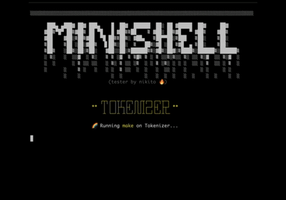

<h1 align="center">mini(s)hell 🔥</h1>

 
Our work on the 42Born2Code <b>minishell</b> project.  

> This project is about creating a simple shell.
Yes, your own little bash.
You will learn a lot about processes and file descriptors.

# Project review

- Taking time on the [tokenization process](src/tokenizer/README.md) made the project so much easier. Once we knew the tokens were divided and recognized correctly, it turned out to be quite easy to implement the execution process as close to bash as possible. While some students used a variation the `split()` function to divide the command line according to blanks, I decided to try to replicate the [Bash rules](src/tokenizer/README.md) as closely as possible and would definitely recommend that approach.
- To aid in that process I decided to take this opportunity to improve my skills in creating testers and automatising the testing process for some of the early stages in the project: `token recognition`, `parsing`/`syntax`, `quote removal` and `variable expansion`. Using the `read` command in my script, I was able to create various raw test files that had `command to test` on the first line, `expected result` on the second line, with a blank line separating each one of those tests. My script would then use those files to run some tests using my functions. It was fire 🔥

 

# Project Requirement Checklist

<i>(+ click to expand)</i>

| Program name       | minishell                                                                                                                                                                                                                                                                                                                                                                                                                                                                    |
|--------------------|------------------------------------------------------------------------------------------------------------------------------------------------------------------------------------------------------------------------------------------------------------------------------------------------------------------------------------------------------------------------------------------------------------------------------------------------------------------------------|
| Turn in files      | Makefile, *.h, *.c                                                                                                                                                                                                                                                                                                                                                                                                                                                           |
| Makefile           | NAME, all, clean, fclean, re                                                                                                                                                                                                                                                                                                                                                                                                                                                 |
| External functions | readline, rl_clear_history, rl_on_new_line, rl_replace_line, rl_dedisplay, add_history, printf, malloc, free, write, access, open, read, close, fork, wait, waitpid, wait3, wait4, signal, sigaction, sigemptyset, sigaddset, kill, exit, getcwd, chdir, stat, lstat, fstat, unlink, execve, dup, dup2, pipe, opendir, readdir, closedir, strerror, perror, isatty, ttyname, ttyslot, ioctl, getenv, tcsetattr, tcgetattr, tgetent, tgetflag, tgetnum, tgetstr, tgoto, tputs |
| Libft authorized   | Yes                                                                                                                                                                                                                                                                                                                                                                                                                                                                          |
| Description        | Write a shell                                                                                                                                                                                                                                                                                                                                                                                                                                                                |

**The shell should:**
- [ ] Display a **prompt** when waiting for a new command
- [ ] Have a working history
- [ ] Search and launch the right executable (based on the `PATH` variable or using a relative or an absolute path).
- [ ] Not use more than **one global variable**. Think about it. You will have to explain its purpose.
- [ ] Not interpret unclosed quotes or special characters which are not requires by the subject such as `\` or `;`.
- [ ] Handle ' (single quote) which should prevent the shell from interpreting the meta-characters in the quotes sequence.
- [ ] Handle `"` (double quote) which should prevent the shell from interpreting the meta-characters in the quotes sequence except for $ (dollar sign).
- [ ] Implement **redirections**
  - [ ] `<` should redirect input.
  - [ ] `>` should redirect output.
  - [ ] `<<` should be given a delimiter, then read the input until a line containing the delimiter is seen. However, it doesn't have to update the history.
  - [ ] `>>` should redirect output in append mode.
- [ ] Implement **pipes** (`|` character). The output of each command in the pipeline is connected to the input of the next command via a pipe.
- [ ] Handle **environment variables** (`$` followed by a sequence of characters) which should expand to their values.
- [ ] Handle `$?` which should expand to the exit status of the most recently executed foreground pipeline.
- [ ] Handle `ctrl-C`, `ctrl-D` and `ctrl-\` which should behave like in bash.
- [ ] In interactive mode
  - [ ] `ctrl-C` displays a new prompt on a new line.
  - [ ] `ctrl-D` exits the shell.
  - [ ] `ctrl-\` does nothing.
- [ ] Your shell must implement the following **builtins**:
  - [ ] `echo` with option `-n`
  - [ ] `cd` with only a relative or absolute path
  - [ ] `pwd` with no options
  - [ ] `export` with no options
  - [ ] `unset` with no options
  - [ ] `env` with no options or arguments
  - [ ] `exit` with no options

> The `readline()` function can cause memory leaks. You don't have to fix them. But that **does not mean your own code can have memory leaks**.

> You should limit yourself to the subject description. Anything that is not asked is not required. If you have any doubt about a requirement, take bash as a reference.

# Testing notes

- Use [this](valgrind_cmd) command to test the project with Valgrind. The flags will allow you to track the leaks and fds in all processes.
- The [readline.supp](readline.supp) file and `--suppressions=readline.supp` flag in the `valgrind` command allows to mark the `readline()` function leaks as `suppressed` to tracking other leaks is easier.

# Research

## Shell operations

Shell reads and executes commands in the following way:
1. Reads its input from a file or terminal.
2. Breaks this input into words and operators, obeying the shell quoting rules. (See [[Bash Rules for Token Recognition]](https://pubs.opengroup.org/onlinepubs/9699919799/utilities/V3_chap02.html#tag_18_03) & [[Our README]](src/tokenizer/README.md).
3. Parses the token (See [Our README](src/parser/README.md))
4. Perfoms the various shell expansions, breaking expanded tokens into lists of filenames and commands and arguments.
5. Performs any necessary redirections and removes the redirection operators and their operands from the argument list.
6. Executes the command.
7. Optionally waits for the command to complete and collects its exit status.

Note: After expanding whatever variables (`$USER` for example), `bash` will run a [word splitting](https://www.gnu.org/software/bash/manual/html_node/Word-Splitting.html). This is something to really think about as it's pretty tricky. While not being specifically asked for this project, we did our best to implement a basic version of it. For example, running `$> export var="cat Makefile"` then `$> $var` would split the expansion content into two different tokens and actually `cat` the `Makefile` file. However, after splitting the words in the command line when `blanks` are present, `bash` will merge them back together following very specific rules that we did not implement completely as it is not really the point of the project.

# Resources

- [x] [Manuel bash](https://www.gnu.org/software/bash/manual/bash.html) ⭐
- [x] 🎥 [Shell Code Explained (1/2)](https://www.youtube.com/watch?v=ubt-UjcQUYg&t=337s) ⭐⭐
- [x] 🎥 [Shell Code - More Details (2/2)](https://www.youtube.com/watch?v=ZjzMdsTWF0U&t=1614s) ⭐⭐
- [x] [Recursive Descent Parsing](https://www.youtube.com/watch?v=SToUyjAsaFk) ⭐⭐
- [ ] [How to Parse Shell Like a Programming Language](https://www.oilshell.org/blog/2019/02/07.html)
- [x] [42Docs](https://harm-smits.github.io/42docs/projects/minishell)
    - [ ] [Git with concepts explained](https://github.com/Swoorup/mysh)
    - [ ] [Understanding the shell syntax](https://pubs.opengroup.org/onlinepubs/009695399/utilities/xcu_chap02.html) ⭐
    - [ ] [lexer -> parser -> expander -> executor](https://www.cs.purdue.edu/homes/grr/SystemsProgrammingBook/Book/Chapter5-WritingYourOwnShell.pdf)
- [ ] [Effective shell](https://effective-shell.com/)
- [ ] [POSIX Docs](https://pubs.opengroup.org/onlinepubs/9699919799/)
- [ ] [Writing your own shell](https://www.cs.purdue.edu/homes/grr/SystemsProgrammingBook/Book/Chapter5-WritingYourOwnShell.pdf)
- [x] [Bash one liners explained](https://catonmat.net/bash-one-liners-explained-part-three)
- [x] [Write a shell in C (Tutorial)](https://brennan.io/2015/01/16/write-a-shell-in-c/)
- [ ] [Understanding ASTs (Abstract Syntax Trees)](https://ruslanspivak.com/lsbasi-part7/)
### La syntaxe de shell :
- [ ] [Bash in Backus-Naur form](https://cmdse.github.io/pages/appendix/bash-grammar.html)

## From other 42 students

- @vietdu91's [project](https://github.com/vietdu91/42_minishell) and his [minishell bible](https://docs.google.com/spreadsheets/d/1uJHQu0VPsjjBkR4hxOeCMEt3AOM1Hp_SmUzPFhAH-nA/edit#gid=0) ✝
- @bboisset's [checklist](https://docs.google.com/spreadsheets/d/1ssdLRjY8lJu4GK5IuoA3nf5Plkt7Kx-dNfc5KxvIcXg/edit?usp=sharing) ✅

# Contributors

 

