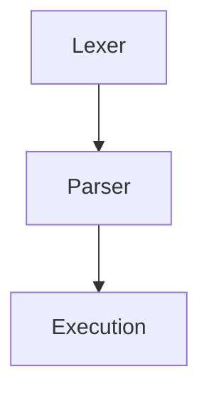

<h1 align="center">mini(s)hell 🔥</h1>

 
Our work on the 42Born2Code <b>minishell</b> project.  

> This project is about creating a simple shell.
Yes, your own little bash.
You will learn a lot about processes and file descriptors.

# [Minishell B*tch](https://www.notion.so/Task-List-Matthieu-Victor-09bcc22ebede42a09f040a39379b5baf)

# To-do

- [ ] implementer env_for_exe
- [ ] builtins: rajouter messages d'erreur malloc (pas urgent)
- [ ] builtins: proteger tous les strjoin & cie
- [ ] `env` : print err message when two many arguments
- [ ] `export` : bug lors des assignamtions
- [ ] `export` `+=` ne fonctionne pas
- [ ] `cd` suppression du dossier parent: voir erreurs de bash
- [ ] Protext all open() and close() calls
- [ ] Do a bunch of `heredoc` + `chmod 0` tests
- [ ] `CTRL + C` from minishell should print out `\n`?
- [ ] `CTRL + C` from heredo leaves current heredoc and exec ?
- [ ] If the program is launched with a empty env, hard code the 3 basic variables
- [ ] Increment `$SHLVL` when the program is lauched
- [ ] If `env` is empty, commands should return `command not found` not `no such filr or directory`
- [ ] Check exit errors codes when passed invalid arguments
- [ ] Test commands with empty sections (token that only has quotes between two `|`)
- [ ] Exit exits only with the code of the latest command ran in minishell
- [ ] `unset` all variables and see if it craches
- [ ] `top -bn1` et grep le process qu'on veut pour verifier qu'il n'y a pas des process qu'on a pas close
- [ ] `< Makefile | ls` doit faire le ls ]
- [ ] Quand je pipe un truc ver `wc` mais que le mot suivant la commande est une expansion vide (avec quotes donc pas invisible), `wc` renvoie une erreur `invalid zero-length file name`, puisque le token du name existe mais est vide.
- [ ] `bash | bash` renvoie des erreurs dans minishell et pas dans bash
- [ ] env -i les chemins absolus doivent fonctionner quand meme
- [ ] Write the easiest tester possible
- [ ] Fix norminette problem in Makefile ! (not urgent)

### Teamwork Guidelines

- Utilisation d'un [Trello](https://trello.com/b/2fylEX2B/mod%C3%A8le-kanban) pour faciliter le suivi de l'avancement et des choses à faire.
- Points réguliers à 11h00.
- Fonctionnement avec branches et Pull Requests.
	- Les PRs doivent être reviewed par nous deux avant d'être `merged`.
	- Tout ce qui est `merged` doit être normé.

# Project Requirement Checklist

<i>(+ click to expand)</i>

| Program name       | minishell                                                                                                                                                                                                                                                                                                                                                                                                                                                                    |
|--------------------|------------------------------------------------------------------------------------------------------------------------------------------------------------------------------------------------------------------------------------------------------------------------------------------------------------------------------------------------------------------------------------------------------------------------------------------------------------------------------|
| Turn in files      | Makefile, *.h, *.c                                                                                                                                                                                                                                                                                                                                                                                                                                                           |
| Makefile           | NAME, all, clean, fclean, re                                                                                                                                                                                                                                                                                                                                                                                                                                                 |
| External functions | readline, rl_clear_history, rl_on_new_line, rl_replace_line, rl_dedisplay, add_history, printf, malloc, free, write, access, open, read, close, fork, wait, waitpid, wait3, wait4, signal, sigaction, sigemptyset, sigaddset, kill, exit, getcwd, chdir, stat, lstat, fstat, unlink, execve, dup, dup2, pipe, opendir, readdir, closedir, strerror, perror, isatty, ttyname, ttyslot, ioctl, getenv, tcsetattr, tcgetattr, tgetent, tgetflag, tgetnum, tgetstr, tgoto, tputs |
| Libft authorized   | Yes                                                                                                                                                                                                                                                                                                                                                                                                                                                                          |
| Description        | Write a shell                                                                                                                                                                                                                                                                                                                                                                                                                                                                |

**The shell should:**
- [ ] Display a **prompt** when waiting for a new command
- [ ] Have a working history
- [ ] Search and launch the right executable (based on the `PATH` variable or using a relative or an absolute path).
- [ ] Not use more than **one global variable**. Think about it. You will have to explain its purpose.
- [ ] Not interpret unclosed quotes or special characters which are not requires by the subject such as `\` or `;`.
- [ ] Handle ' (single quote) which should prevent the shell from interpreting the meta-characters in the quotes sequence.
- [ ] Handle `"` (double quote) which should prevent the shell from interpreting the meta-characters in the quotes sequence except for $ (dollar sign).
- [ ] Implement **redirections**
  - [ ] `<` should redirect input.
  - [ ] `>` should redirect output.
  - [ ] `<<` should be given a delimiter, then read the input until a line containing the delimiter is seen. However, it doesn't have to update the history.
  - [ ] `>>` should redirect output in append mode.
- [ ] Implement **pipes** (`|` character). The output of each command in the pipeline is connected to the input of the next command via a pipe.
- [ ] Handle **environment variables** (`$` followed by a sequence of characters) which should expand to their values.
- [ ] Handle `$?` which should expand to the exit status of the most recently executed foreground pipeline.
- [ ] Handle `ctrl-C`, `ctrl-D` and `ctrl-\` which should behave like in bash.
- [ ] In interactive mode
  - [ ] `ctrl-C` displays a new prompt on a new line.
  - [ ] `ctrl-D` exits the shell.
  - [ ] `ctrl-\` does nothing.
- [ ] Your shell must implement the following **builtins**:
  - [ ] `echo` with option `-n`
  - [ ] `cd` with only a relative or absolute path
  - [ ] `pwd` with no options
  - [ ] `export` with no options
  - [ ] `unset` with no options
  - [ ] `env` with no options or arguments
  - [ ] `exit` with no options

> The `readline()` function can cause memory leaks. You don't have to fix them. But that **does not mean your own code can have memory leaks**.

> You should limit yourself to the subject description. Anything that is not asked is not required. If you have any doubt about a requirement, take bash as a reference.

# Research

## Shell operations

Shell reads and executes commands in the following way:
1. Reads its input from a file or terminal.
2. Breaks this input into words and operators, obeying the shell quoting rules.
   - Alias expansion is performed here.
3. Parses the token in to _simple_ and _compound_ commands.
4. Perfoms the various shell expansions, breaking expanded tokens into lists of filenames and commands and arguments.
5. Performs any necessary redirections and removes the redirection operators and their operands from the argument list.
6. Executes the command.
7. Optionally waits for the command to complete and collects its exit status.

## Token Recognition

[See README](src/tokenizer/README.md)

## Simple Command Expansion

When a simple command is executed, the shell performs the following expansions, assignments, and redirections, from left to right, in the following order:
1. The words that the parser has marked as variable assignments (those preceding the command name) and redirections are saved for later processing.
2. The words that are not variable assignments or redirections are expanded. If any words remain after expansion, the first word is taken to be the name of the command and the remaining words are the arguments.
3. Redirections are performed.
4. The text after the `=` in each variable assignment undergoes tilde expansion, parameter expansion, command substitution, arithmetic expansion, and quote removal before being assigned to the variable.  

(Look at docs for details)

# Minishell Process

## Lexer
### Token Recognition

[See Bash Rules for Token Recognition](https://pubs.opengroup.org/onlinepubs/9699919799/utilities/V3_chap02.html#tag_18_03)

# Resources

## Online

- [x] 🎥 [Shell Code Explained (1/2)](https://www.youtube.com/watch?v=ubt-UjcQUYg&t=337s) ⭐⭐
- [x] 🎥 [Shell Code - More Details (2/2)](https://www.youtube.com/watch?v=ZjzMdsTWF0U&t=1614s) ⭐⭐
- [x] [Recursive Descent Parsing](https://www.youtube.com/watch?v=SToUyjAsaFk) ⭐⭐
- [ ] [How to Parse Shell Like a Programming Language](https://www.oilshell.org/blog/2019/02/07.html)
- [x] [42Docs](https://harm-smits.github.io/42docs/projects/minishell)
    - [ ] [Git with concepts explained](https://github.com/Swoorup/mysh)
    - [ ] [Understanding the shell syntax](https://pubs.opengroup.org/onlinepubs/009695399/utilities/xcu_chap02.html) ⭐
    - [ ] [lexer -> parser -> expander -> executor](https://www.cs.purdue.edu/homes/grr/SystemsProgrammingBook/Book/Chapter5-WritingYourOwnShell.pdf)
- [ ] [Effective shell](https://effective-shell.com/)
- [ ] [Manuel bash](https://www.gnu.org/software/bash/manual/bash.html) ⭐
- [ ] [POSIX Docs](https://pubs.opengroup.org/onlinepubs/9699919799/)
- [ ] [Writing your own shell](https://www.cs.purdue.edu/homes/grr/SystemsProgrammingBook/Book/Chapter5-WritingYourOwnShell.pdf)
- [x] [Bash one liners explained](https://catonmat.net/bash-one-liners-explained-part-three)
- [x] [Write a shell in C (Tutorial)](https://brennan.io/2015/01/16/write-a-shell-in-c/)
- [ ] [Understanding ASTs (Abstract Syntax Trees)](https://ruslanspivak.com/lsbasi-part7/)
### La syntaxe de shell :
- [ ] [Bash in Backus-Naur form](https://cmdse.github.io/pages/appendix/bash-grammar.html)

## From other 42 students

- @vietdu91's [project](https://github.com/vietdu91/42_minishell)  
    - And his [minishell bible](https://docs.google.com/spreadsheets/d/1uJHQu0VPsjjBkR4hxOeCMEt3AOM1Hp_SmUzPFhAH-nA/edit#gid=0) ✝
- @bboisset's [checklist](https://docs.google.com/spreadsheets/d/1ssdLRjY8lJu4GK5IuoA3nf5Plkt7Kx-dNfc5KxvIcXg/edit?usp=sharing) ✅

# Contributors

 

